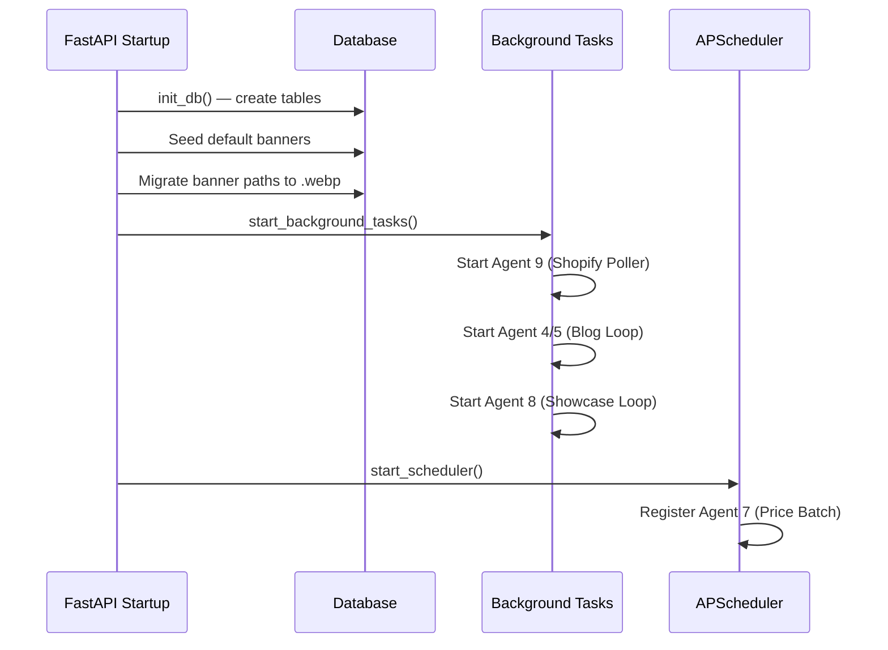
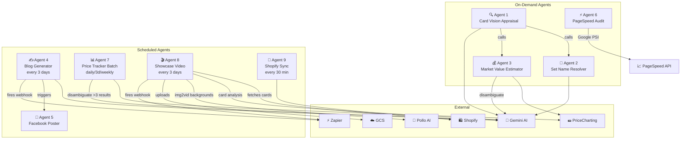

# TCGNakama — Agent Swarms

> A complete inventory of every autonomous agent running in the TCGNakama platform, their orchestration, scheduling, and inter-agent data flows.

---

## Agent Census: 9 Agents

| # | Agent | AI Model | Trigger | Cadence |
|---|---|---|---|---|
| 1 | Card Vision Appraisal | Gemini 2.5 Flash (vision) | User upload | On-demand |
| 2 | Set Name Resolver | Gemini 2.5 Flash (text) | Post-appraisal | On-demand |
| 3 | Market Value Estimator | PriceCharting + Gemini disambiguation | Post-appraisal | On-demand |
| 4 | Blog Generator | Gemini 2.5 Flash (text) | Scheduler | Every 3 days |
| 5 | Facebook Poster | Facebook Graph API | Post blog-gen | After each blog |
| 6 | PageSpeed Audit | Google PSI API | Admin button | On-demand + cache |
| 7 | Price Tracker (Batch) | PriceCharting + Gemini | APScheduler cron | Daily / 3-day / weekly |
| 8 | Showcase Video Pipeline | Gemini + Pollo 1.6 + ffmpeg | Scheduler | Every 3 days |
| 9 | Shopify Sync Poller | Shopify Storefront API | asyncio loop | Every 30 min |

---

## Agent Profiles

### Agent 1 — Card Vision Appraisal

> **Purpose**: Analyze a card photo to extract structured metadata (name, set, number, rarity, condition, year, manufacturer).

| Property | Value |
|---|---|
| **File** | [appraisal.py](file:///c:/Users/admin/.gemini/antigravity/scratch/TCGNakama/app/services/appraisal.py) |
| **Function** | `appraise_card_from_image()` |
| **AI Model** | Gemini 2.5 Flash (multimodal vision) |
| **Input** | Image bytes or image URL |
| **Output** | Structured JSON: `card_name`, `set_name`, `full_set_name`, `card_number`, `rarity`, `card_condition`, `special_variants`, `year`, `manufacturer` |
| **Concurrency** | Serialized via `_gemini_lock` (one Gemini call at a time) |

**Post-processing pipeline** (7 stages):
1. Strip markdown fences from Gemini response
2. Extract JSON from response text
3. Filter ID-format card numbers
4. Strip rarity suffixes from card numbers (e.g. `088/071 SR` → `088/071`)
5. Detect PROMO set from card number format
6. Strip regulation mark misidentified as set name
7. Map raw rarity to internal tier (`Common` / `Rare` / `Epic` / `Ultra Rare`)

**Image enhancement**: Brightness +30%, contrast +20% before sending to Gemini.

---

### Agent 2 — Set Name Resolver

> **Purpose**: Expand a short set code (e.g. `OP12`, `SV5M`) into its full official name using Gemini AI.

| Property | Value |
|---|---|
| **File** | [appraisal.py](file:///c:/Users/admin/.gemini/antigravity/scratch/TCGNakama/app/services/appraisal.py) |
| **Function** | `resolve_full_set_name()` |
| **AI Model** | Gemini 2.5 Flash (text, `temperature: 0.1`) |
| **Input** | Card name, set code, card number |
| **Output** | Full set name string (e.g. `"Romance Dawn"`, `"Cyber Judge"`) |
| **Trigger** | Called by Agent 1 when `full_set_name` is missing or matches `set_name` |

---

### Agent 3 — Market Value Estimator

> **Purpose**: Estimate a card's market value in JPY using PriceCharting prices + currency conversion.

| Property | Value |
|---|---|
| **File** | [appraisal.py](file:///c:/Users/admin/.gemini/antigravity/scratch/TCGNakama/app/services/appraisal.py) |
| **Functions** | `get_market_value_jpy()` → `estimate_market_value_usd()` |
| **Data Sources** | PriceCharting API → PriceCharting scraping → mock fallback |
| **AI Component** | Gemini 2.5 Flash filters ambiguous PriceCharting results via `_gemini_filter_cards()` |
| **Output** | `{ market_usd, market_jpy, exchange_rate, confidence }` |
| **Currency** | USD → JPY via Frankfurter API (fallback: 153.7) |
| **Cache** | 5-minute TTL, keyed by `card_name|rarity|set_name|card_number|variants` |

**Disambiguation logic**: When PriceCharting returns multiple results, Gemini ranks them by:
1. Card number match (highest priority)
2. Regular version preferred over `[Alt Art]`, `[Promo]`, etc.
3. English version preferred over Japanese
4. Base card name match

---

### Agent 4 — Blog Generator

> **Purpose**: Auto-generate SEO-optimised TCG blog articles using Gemini AI, with rotated topic categories.

| Property | Value |
|---|---|
| **File** | [blog_generator.py](file:///c:/Users/admin/.gemini/antigravity/scratch/TCGNakama/app/services/blog_generator.py) |
| **Function** | `generate_article()` |
| **AI Model** | Gemini 2.5 Flash → fallback `gemini-2.0-flash-001` |
| **Output** | `BlogPost` ORM object (title, HTML, markdown, slug, category, tags) |
| **Scheduler** | [background_tasks.py](file:///c:/Users/admin/.gemini/antigravity/scratch/TCGNakama/app/background_tasks.py) `_blog_loop()` |
| **Cadence** | Every 3 days + random 0–12 hour offset |

**Topic rotation** (7 weighted topics):

| Category | Weight | Focus |
|---|---|---|
| Pokémon TCG | 3 | Set reveals, meta, Illustration Rares |
| Pokémon Anime | 2 | Episodes, movies, character lore |
| One Piece TCG | 2 | Card sets, Luffy leaders, price spikes |
| One Piece Anime | 2 | Episodes, arcs, movies |
| MTG | 1 | Japanese editions, commander, prices |
| Tips | 1 | Grading, condition, buying guides |
| News | 2 | Multi-story TCG market roundup |

**Source intelligence**: Articles cite authoritative TCG community sources (PTCGRadio, PokeBeach, PokeGuardian, One Piece Top Decks, etc.).

**Post-publish actions**: Fires Zapier webhook with blog URL, title, excerpt, and tags.

---

### Agent 5 — Facebook Poster

> **Purpose**: Auto-post new blog articles to the TCGNakama Facebook Page.

| Property | Value |
|---|---|
| **File** | [facebook_poster.py](file:///c:/Users/admin/.gemini/antigravity/scratch/TCGNakama/app/services/facebook_poster.py) |
| **Function** | `post_to_facebook_group()` |
| **API** | Facebook Graph API v19 |
| **Auth** | Page Access Token (`pages_manage_posts`) |
| **Trigger** | Called after Agent 4 publishes a blog post |
| **Status** | Plugin stub — activated by setting `FACEBOOK_PAGE_ID` + `FACEBOOK_PAGE_ACCESS_TOKEN` |

---

### Agent 6 — PageSpeed Audit

> **Purpose**: Run Google PageSpeed Insights audits and track performance over time.

| Property | Value |
|---|---|
| **File** | [pagespeed.py](file:///c:/Users/admin/.gemini/antigravity/scratch/TCGNakama/app/services/pagespeed.py) |
| **Function** | `run_audit()` |
| **API** | Google PageSpeed Insights API v5 |
| **Categories** | Performance, Accessibility, Best Practices, SEO |
| **Storage** | `pagespeed_audits` table (scores + full JSON response) |
| **Rate Limit** | 60-second cooldown between runs |
| **Cache** | 24-hour freshness check |
| **Trigger** | Admin panel button (on-demand) |

**Status tracking**: Uses `system_settings` table with keys `psi_status`, `psi_progress`, `psi_message` for a real-time progress bar in the admin UI. States: `IDLE → QUEUED → ANALYZING → PARSING → SAVING → COMPLETED`.

---

### Agent 7 — Price Tracker (Batch)

> **Purpose**: Batch-update market prices for the entire Shopify catalog using PriceCharting API.

| Property | Value |
|---|---|
| **File** | [price_tracker.py](file:///c:/Users/admin/.gemini/antigravity/scratch/TCGNakama/app/services/price_tracker.py) |
| **Scheduler** | [scheduler.py](file:///c:/Users/admin/.gemini/antigravity/scratch/TCGNakama/app/scheduler.py) (APScheduler) |
| **Function** | `run_batch_update()` |
| **Throttle** | 1 request per 1.1 seconds |
| **AI** | Gemini disambiguation only when >3 ambiguous PriceCharting results |
| **Output** | `PriceSnapshot` rows (product_id, USD, JPY, exchange_rate, timestamp) |

**Scheduling options** (admin-configurable):

| Frequency | Cron | Default? |
|---|---|---|
| Daily | `3:00 AM JST` | |
| Every 3 days | `*/3 3:00 AM JST` | |
| Weekly | `Sun 3:00 AM JST` | ✅ |

**Capacity**: Designed for 5,000+ cards at 1 req/sec with smart Gemini ambiguity mode.

---

### Agent 8 — Showcase Video Pipeline

> **Purpose**: Generate animated "New Cards Showcase" videos featuring the latest inventory and upload to GCS.

| Property | Value |
|---|---|
| **File** | [test_flywheel_video.py](file:///c:/Users/admin/.gemini/antigravity/scratch/TCGNakama/app/../test_flywheel_video.py) |
| **Scheduler** | [background_tasks.py](file:///c:/Users/admin/.gemini/antigravity/scratch/TCGNakama/app/background_tasks.py) `_showcase_loop()` |
| **Cadence** | Every 3 days |
| **AI Models** | Gemini 2.5 Flash (card analysis) + Pollo AI v1.6 (img2vid) |

**6-stage pipeline**:

```
 1. Fetch top-3 Fresh Pulls from Shopify
 2. Download card images
 3. Per-card: Gemini analyzes card → unique cinematic prompt
 4. Per-card: Pollo v1.6 generates animated background video
 5. ffmpeg composites intro + card segments with xfade transitions
 6. Upload final video + manifest to GCS
```

**Deduplication**: Compares `card_ids` with `showcase/last_run.json` on GCS. Skips generation if same cards.

**Post-pipeline**: Fires Zapier webhook with video URL, card data, and a pre-built social media caption.

---

### Agent 9 — Shopify Sync Poller

> **Purpose**: Keep an in-memory cache of products and collections synced with Shopify.

| Property | Value |
|---|---|
| **File** | [background_tasks.py](file:///c:/Users/admin/.gemini/antigravity/scratch/TCGNakama/app/background_tasks.py) |
| **Function** | `polling_task()` → `sync_shopify_products()` |
| **API** | Shopify Storefront GraphQL API |
| **Cadence** | Every 30 minutes (initial sync on startup) |
| **Output** | `_cached_products` + `_cached_collections` (in-memory) |

**Parallelism**: Products and collections fetched concurrently via `asyncio.gather()`.

---

## Orchestration Architecture

### Startup Lifecycle



### Agent Interaction Map



### Shared Resources & Rate Limiting

| Resource | Agents Using It | Protection |
|---|---|---|
| `_gemini_lock` (asyncio.Lock) | Agents 1, 2, 3, 7 | Serializes all Gemini calls to prevent 429 errors |
| `_batch_running` flag | Agent 7 | Prevents concurrent batch price updates |
| PriceCharting API | Agents 3, 7 | 1.1s sleep between requests |
| PageSpeed rate limiter | Agent 6 | 60s cooldown in `system_settings` |
| `psi_status` semaphore | Agent 6 | DB-backed status prevents parallel audits |

---

## Environment Variables

| Variable | Agent(s) | Required? |
|---|---|---|
| `GEMINI_API_KEY` | 1, 2, 3, 4, 7, 8 | ✅ Core |
| `SHOPIFY_STORE_URL` | 9, 8 | ✅ Core |
| `SHOPIFY_STOREFRONT_TOKEN` | 9, 8 | ✅ Core |
| `PRICECHARTING_API_KEY` | 3, 7 | ✅ For pricing |
| `GOOGLE_PAGESPEED_API_KEY` | 6 | For PSI audits |
| `POLLO_API_KEY` | 8 | For video gen |
| `GCP_PROJECT_ID` | 8 | For GCS upload |
| `GCS_BUCKET` | 8 | For GCS upload |
| `GOOGLE_CREDENTIALS_JSON` / `_BASE64` | 8 | GCS auth |
| `FACEBOOK_PAGE_ID` | 5 | For FB posting |
| `FACEBOOK_PAGE_ACCESS_TOKEN` | 5 | For FB posting |
| `ZAPIER_WEBHOOK_URL` | 4 | Blog → social |
| `ZAPIER_SHOWCASE_WEBHOOK_URL` | 8 | Video → social |
| `SMTP_EMAIL` / `SMTP_PASSWORD` | Email service | For notifications |
| `ADMIN_EMAIL` | Email service | Report recipient |
