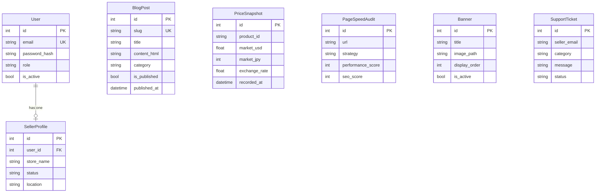
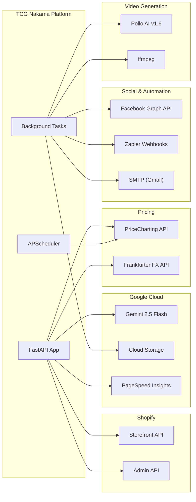

# TCGNakama — Project Ontology

> A complete map of the platform's domain model, data architecture, external integrations, and system taxonomy.

---

## 1. Domain Entities

### 1.1 Card / Product

The atomic unit of the marketplace. A **card** is a single collectible trading card listed for sale.

| Field | Source | Example |
|---|---|---|
| `id` / `safe_id` | Shopify GID | `gid://shopify/Product/12345` → `12345` |
| `title` | Shopify + Gemini formatting | `リザードン (Charizard) - SV5M #001/024` |
| `set` (code) | Shopify tag `set:SV5M` | `SV5M`, `OP12`, `PROMO` |
| `set_name` (full) | Gemini AI resolution | `Cyber Judge`, `Romance Dawn` |
| `rarity` | Appraisal → mapped | `Common`, `Rare`, `Ultra Rare`, `Epic` |
| `card_number` | Shopify tag / Appraisal | `#001/024`, `P-044` |
| `price` (JPY) | Shopify variant | `3750000.0` |
| `card_condition` | Appraisal / Shopify tag | `Near Mint`, `Lightly Played`, `Mostly Played` |
| `package_type` | Shopify tag `condition:` | `Raw`, `Toploader`, `Booster Pack`, `Slab` |
| `totalInventory` | Shopify | `1`, `0` (Sold Out) |
| `collections` | Shopify | `["Pokémon", "One Piece"]` |
| `vendor` | Shopify | `TCG Nakama` |

### 1.2 TCG Game Types

Defined in [ontology.py](file:///c:/Users/admin/.gemini/antigravity/scratch/TCGNakama/app/ontology.py):

| Enum Value | Display Name |
|---|---|
| `POKEMON` | Pokémon |
| `ONE_PIECE` | One Piece |
| `MAGIC` | Magic: The Gathering |
| `YU_GI_OH` | Yu-Gi-Oh! |

### 1.3 Card Condition Grades

| Code | Meaning |
|---|---|
| `Mint` | Perfect, factory-fresh |
| `Near Mint` | No visible wear (default) |
| `Lightly Played` | Minor edge whitening |
| `Moderately Played` | Significant wear |
| `Heavily Played` | Major damage visible |
| `Damaged` | Creases, tears, water damage |

### 1.4 Rarity Taxonomy

The appraisal agent normalizes raw rarity into an internal tier system:

```
Common ← common, C
Uncommon ← uncommon, UC
Rare ← rare, holo rare, reverse holo, R, ★
Epic ← super rare (Yu-Gi-Oh)
Ultra Rare ← SR, SAR, SEC, UR, HR, mythic rare, starlight rare,
              prism, crystal, shining, gold star, ★★, ★★★
```

### 1.5 Card Location Taxonomy

Physical location of inventory, defined in [cost_db.py](file:///c:/Users/admin/.gemini/antigravity/scratch/TCGNakama/app/cost_db.py):

| Location | Active? | Notes |
|---|---|---|
| `Display` | ✅ | Visible in-store |
| `Folder` | ✅ | Default; binder storage |
| `Vault` | ✅ | High-value secure storage |
| `Grading` | ✅ | Sent to PSA/BGS/CGC |
| `Repair` | ✅ | Condition improvement |
| `Mercari` | ✅ | Cross-listed on Mercari |
| `Consignment` | ✅ | Held by third party |
| `Sold-Pending` | ❌ | Sold, not yet shipped |
| `Archived` | ❌ | Removed from active inventory |

---

## 2. Data Architecture

### 2.1 Databases

| Database | Engine | Purpose | Key Tables |
|---|---|---|---|
| **Main App DB** | SQLite / PostgreSQL | Core platform state | `banners`, `blog_posts`, `price_snapshots`, `pagespeed_audits`, `system_settings`, `users`, `seller_profiles`, `support_tickets` |
| **Cost DB** | SQLite / PostgreSQL | Business intelligence | `product_costs`, `product_grades`, `product_locations`, `search_logs`, `value_snapshots` |

### 2.2 Database Models



### 2.3 In-Memory Caches

| Cache | TTL | Purpose |
|---|---|---|
| `_cached_products` | 30 min (polling) | Full Shopify product catalog |
| `_cached_collections` | 30 min (polling) | Shopify collections |
| `_appraisal_cache` | 5 min | Card appraisal results keyed by card details |

---

## 3. External Integrations

### 3.1 API Integrations Map



### 3.2 Integration Details

| Service | Purpose | Auth | Rate Management |
|---|---|---|---|
| **Shopify Storefront API** | Products, cart, checkout, collections | `X-Shopify-Storefront-Access-Token` | Connection pooling (10 max) |
| **Shopify Admin API** | Product CRUD, collection management | `X-Shopify-Access-Token` | Per-request |
| **Gemini 2.5 Flash** | Vision appraisal, set resolution, card filtering, blog writing, card analysis | API key | Async lock (`_gemini_lock`) |
| **PriceCharting API** | Market price lookup (USD) | API key param `t=` | 1 req/1.1 sec throttle |
| **Frankfurter API** | USD → JPY exchange rate | None (public) | Cached per batch |
| **Google PageSpeed Insights** | Performance/SEO audit | API key | 60s rate limit |
| **Google Cloud Storage** | Showcase video hosting, manifest | Service account (ADC) | — |
| **Pollo AI v1.6** | img2vid animated card backgrounds | `x-api-key` header | 6 min poll timeout |
| **Facebook Graph API v19** | Auto-post blog articles | Page Access Token | — |
| **Zapier Webhooks** | Blog → social, Showcase video → Facebook | Webhook URL | Fire-and-forget |
| **SMTP (Gmail)** | Seller emails, daily analytics report | Username/password | — |

---

## 4. UI/UX Design System

> [!IMPORTANT]
> The storefront and admin panel use **two separate design modes**. All new UI work must follow the correct mode's tokens.

### 4.1 Design Modes

| Mode | Pages | Background | Text | Vibe |
|---|---|---|---|---|
| **Vault (Storefront)** | Homepage, card detail, blog, cart, about | `#0B1120` | White/gray | Dark luxury, holographic TCG vault |
| **Admin (Dashboard)** | `/admin/*`, `/seller-admin/*` | `#f3f4f6` | Dark gray/black | Clean utility, light panels |
| **Seller Portal** | `/seller/*` | `#0B1120` | White | Matches Vault mode |

### 4.2 Color Tokens

| Token | Hex | Usage |
|---|---|---|
| `primary` | `#FFD700` | Brand gold — CTA buttons, active nav, price text, badges |
| `primary-dark` | `#B8960F` | Button hover state |
| `background-dark` | `#0B1120` | Page background (storefront) |
| `surface` | `#111827` | Card backgrounds, panels |
| `surface-light` | `#1F2937` | Elevated surfaces, borders |
| `vault-card` | `#111827` | Product card background |
| `vault-border` | `#1F2937` | Card border color |
| `neon-red` | `#EF4444` | Sold out, errors, cart badge, danger |
| `neon-green` | `#22C55E` | In stock, success, price gainers, sparklines |
| `accent-blue` | `#3B82F6` | Links, info badges |
| `sky-400/80` | `rgba(56,189,248,0.8)` | Set name text, secondary metadata |

### 4.3 Typography

| Property | Value |
|---|---|
| **Font family** | `Space Grotesk` (Google Fonts) — display + body |
| **Weights loaded** | 400 (regular), 600 (semibold) |
| **Icon set** | Material Symbols Outlined (38 icons selectively loaded) |
| **Heading style** | Bold (`font-bold`), tight tracking (`tracking-tight`) |
| **Label style** | `text-[10px] font-bold uppercase tracking-wider text-gray-400` |
| **Price style** | `text-sm font-black text-primary` (tabular nums for alignment) |

### 4.4 Glassmorphism & Effects

| Class | Effect | Usage |
|---|---|---|
| `obsidian-glass` | Dark semi-transparent panel with blur + gold border glow | Modal overlays, elevated panels |
| `glass-hero` | Lighter transparent panel with blur + white border | Hero sections |
| `holographic-glow` | Gold box-shadow glow | Premium card highlights |
| `gold-glow` | Double-layer gold shadow | CTA buttons |
| `vault-card-outline` | Faint gold border (`rgba(255,215,0,0.1)`) | Product cards |
| `live-pulse` | 2s opacity pulse animation | "LIVE" badges |
| `hype-bar` | Red gradient bar with CSS variable width | Market hype indicator |

### 4.5 Component Patterns

| Component | Pattern |
|---|---|
| **Product card** | `bg-surface rounded-xl border border-white/[0.1]` + hover `border-primary/30` |
| **CTA button** | `bg-primary text-background-dark font-black rounded-full` + `gold-glow` shadow |
| **Ghost button** | `bg-primary/15 border border-primary/30 text-primary rounded` |
| **Search bar** | `rounded-full bg-white/5 border border-white/10` + focus `border-primary/50` |
| **Filter pill** | `rounded-full border border-white/10 bg-white/5 text-gray-300` + active `bg-primary/20 border-primary/40 text-primary` |
| **Badge** | `text-[8px] font-black uppercase px-1.5 py-0.5 rounded` |
| **Section header** | Emoji + bold title + `LIVE` badge with pulse dot |
| **Dropdown** | `bg-surface border border-white/10 rounded-xl shadow-2xl` |
| **Toast** | Slides in from top, auto-dismisses with icon swap |
| **Mobile filter** | Bottom sheet with drag handle, scrollable content, sticky footer |

### 4.6 Interaction Patterns

| Pattern | Technology |
|---|---|
| **Search filtering** | HTMX `hx-get="/filter"` with 300ms debounce |
| **Cart operations** | Fetch API → optimistic UI update → revert on error |
| **Carousel** | Pure JS with CSS `transition-transform` |
| **Mobile nav** | Bottom sheet (`translate-y-full` → `translate-y-0`) |
| **Loading states** | `htmx-indicator` class + spinning `sync` icon |
| **Sold out guard** | HTTP 409 → toast notification → button disable |

### 4.7 Responsive Breakpoints

| Breakpoint | Class Prefix | Key Layout Changes |
|---|---|---|
| Default (mobile) | — | 2-col product grid, bottom sheet filters, compact nav |
| `md` (768px) | `md:` | 3-col grid, inline filter bar, desktop nav, utility bar |
| `lg` (1024px) | `lg:` | 4-col grid, wider search bar |

---

## 5. Application Architecture

### 5.1 Tech Stack

| Layer | Technology |
|---|---|
| **Framework** | FastAPI (Python) |
| **Server** | Uvicorn |
| **ORM** | SQLAlchemy |
| **Templates** | Jinja2 |
| **Styling** | Tailwind CSS |
| **Deployment** | DigitalOcean App Platform / Docker |
| **Package Manager** | pip (`requirements.txt`) |

### 5.2 Module Map

```
app/
├── main.py               # FastAPI app, startup/shutdown, SEO routes
├── dependencies.py        # ShopifyClient (Storefront + Admin API)
├── database.py            # SQLAlchemy engine & session
├── models.py              # ORM models (Banner, BlogPost, User, etc.)
├── ontology.py            # Card domain types (enums, TypedDict)
├── cost_db.py             # Business intelligence DB (costs, grades, locations)
├── email_service.py       # SMTP email templates
├── background_tasks.py    # Shopify poller, blog scheduler, showcase scheduler
├── scheduler.py           # APScheduler for price batch jobs
├── routers/
│   ├── store.py           # Public storefront routes
│   ├── admin.py           # Admin dashboard (119KB — largest file)
│   ├── blog.py            # Blog listing & detail pages
│   ├── seller.py          # Seller auth & onboarding
│   └── oauth.py           # OAuth flow for Shopify
├── services/
│   ├── appraisal.py       # Gemini vision + PriceCharting market value
│   ├── blog_generator.py  # AI article generation
│   ├── facebook_poster.py # Facebook page auto-posting
│   ├── pagespeed.py       # Google PSI audits
│   ├── price_tracker.py   # Batch price updates
│   ├── seller_auth.py     # Seller authentication
│   └── shopify_auth.py    # Shopify OAuth
├── utils/
│   ├── image_utils.py     # Image handling
│   └── mock_data.py       # Development mock products
├── static/                # CSS, JS, images, banners
├── templates/             # Jinja2 HTML templates
└── data/                  # SQLite DB files
```

### 5.3 Router Map

| Router | Prefix | Purpose |
|---|---|---|
| `store` | `/` | Homepage, card detail, cart, checkout |
| `admin` | `/admin` + `/seller-admin` | Full admin dashboard |
| `blog` | `/blog` | Blog listing, detail, admin blog management |
| `seller` | `/seller` | Seller login, registration, logout |
| `oauth` | `/` | Shopify OAuth callbacks |

### 5.4 Key Static Routes

| Route | Purpose |
|---|---|
| `/about` | Static about page |
| `/robots.txt` | SEO crawl directives (allows GPTBot, ClaudeBot, PerplexityBot) |
| `/sitemap.xml` | Dynamic XML sitemap (cards + blog posts) |
| `/llms.txt` | AI discoverability metadata |
| `/api/track-search` | Search analytics tracking |

---

## 6. Testing Architecture

### 6.1 Test Directory Structure

```
tests/
├── conftest.py              # Shared pytest fixtures (mock card data, mock responses)
├── test_prompt_context.py   # Validates all role contexts return correct grounding
├── test_ontology.py         # Validates domain enums and helpers haven't drifted
├── test_appraisal_logic.py  # Pure logic: rarity mapping, card number parsing (no API)
└── archive/                 # 70 legacy debug scripts (reference only, not runnable)
    └── README.md
```

### 6.2 Testing Strategy

| Layer | What | Requires API? | Runner |
|---|---|---|---|
| **Unit tests** (`tests/`) | Domain logic, prompt context, ontology validation | ❌ Offline | `pytest` |
| **Legacy scripts** (`tests/archive/`) | Ad-hoc debugging scripts from development | ✅ Live APIs + localhost | Manual `python` |
| **Manual verification** | Appraisal upload, blog generation, cart flow | ✅ Live server | Browser / curl |

### 6.3 Run Command

```bash
python -m pytest tests/ -v --ignore=tests/archive
```

> [!IMPORTANT]
> All proper tests must be **offline** — no live API keys, no running server, no network calls. Mock external dependencies in `conftest.py`. Legacy scripts in `tests/archive/` are kept for reference only and are excluded from the test runner.
